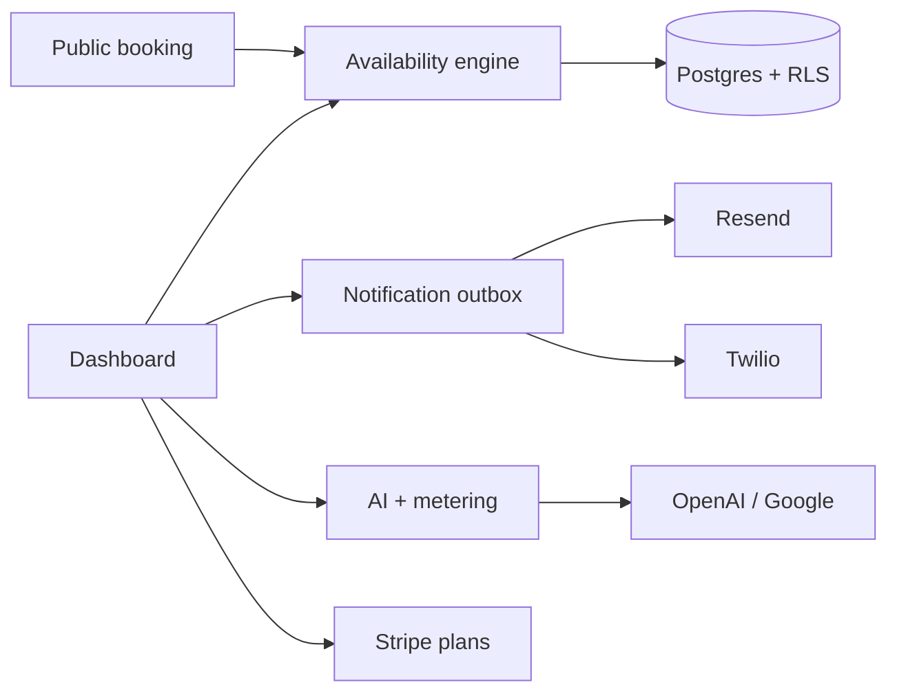

# BookFlow AI

**Multi-tenant booking OS for service businesses** — public booking, ops dashboard, automation, and AI on one stack.

[Live demo](https://bookflow-ai-isga.vercel.app) · [Book an appointment](https://bookflow-ai-isga.vercel.app/book/bookflow) · [Portfolio pack](./docs/portfolio/README.md) · [Go-live checklist](./GO_LIVE.md)

Screenshots: capture with [`docs/portfolio/screenshots.md`](./docs/portfolio/screenshots.md), then drop them into `docs/portfolio/screenshots/`.

## Why it exists

Barbers and salons lose chairs to phone-tag booking and no-shows. Most tools either stop at a calendar embed or bolt on “AI” that doesn’t know real availability, tenancy, or plan limits.

BookFlow AI is a production-shaped SaaS: org isolation, Stripe entitlements, reliable notification outbox, and an AI workbench metered against those plans.

## Product surface

| For customers | For owners |
| ------------- | ---------- |
| Branded `/book/[slug]` wizard | Calendar, clients, staff, services, hours |
| Service → staff → time → details | Analytics (revenue, staff, customers) |
| Confirmation + manage token | Automation toggles + billing |
| Custom domain ready | AI summaries, drafts, insights, booking assistant |

**Vertical packs:** barber/salon (default), dental, tutors, gyms — terminology and seed services per vertical.

## Architecture (summary)



Full diagram and sequence notes: [`docs/portfolio/architecture.md`](./docs/portfolio/architecture.md)  
Database ERD: [`docs/portfolio/erd.md`](./docs/portfolio/erd.md)  
Case study template: [`docs/portfolio/case-study.md`](./docs/portfolio/case-study.md)

## Stack

- **App:** Next.js 15 (App Router) · React 19 · TypeScript · Tailwind CSS 4
- **Data:** Prisma 7 · PostgreSQL (exclusion constraints, RLS)
- **Auth:** Clerk
- **Billing:** Stripe (Trial / Starter / Growth / Business)
- **Comms:** Resend · Twilio
- **AI:** Vercel AI SDK · OpenAI + Google providers
- **Scale:** Upstash Redis (optional) · feature flags · Sentry · Pino
- **Quality:** Vitest · Playwright + axe · Lighthouse / load smoke scripts

## Portfolio assets

Everything for client acquisition lives in [`docs/portfolio/`](./docs/portfolio/README.md):

- Architecture diagram · Database ERD · Case study  
- Demo video script · Screenshot checklist · LinkedIn launch post  

Landing page is the marketing route at `/`.

## Local setup

```bash
cp .env.example .env.local
# Fill DATABASE_URL + Clerk keys (see .env.example)
npm install
npm run db:generate
npm run db:migrate
npm run dev
```

Optional: Upstash Redis for shared rate limits and slot cache across instances. Without it, in-memory fallbacks work for single-instance / Hobby.

Clerk webhook → `https://<host>/api/webhooks/clerk` (`user.created` / `updated` / `deleted`) with `CLERK_WEBHOOK_SIGNING_SECRET`.

Production deploy: [`GO_LIVE.md`](./GO_LIVE.md).

## Quality gates

```bash
npm run lint && npm test && npm run typecheck && npm run build
npm run test:e2e
npm run load:smoke        # LOAD_ORG_SLUG=bookflow
npm run lighthouse:smoke  # against a running prod server
```

## Scripts

| Script | Purpose |
| ------ | ------- |
| `npm run dev` | Local development |
| `npm run build` | Production build |
| `npm run lint` / `typecheck` / `format` | Quality |
| `npm run db:migrate` / `db:studio` | Prisma |
| `npm test` / `test:e2e` | Unit + Playwright |

## License / contact

Private portfolio project unless otherwise noted. For pilots or freelance work, open an issue or reach out via the LinkedIn launch post in [`docs/portfolio/linkedin-launch.md`](./docs/portfolio/linkedin-launch.md).
