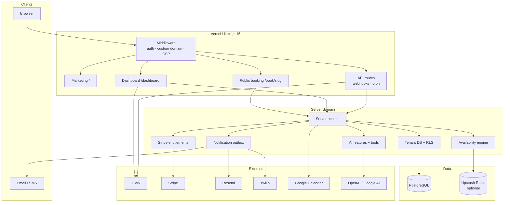
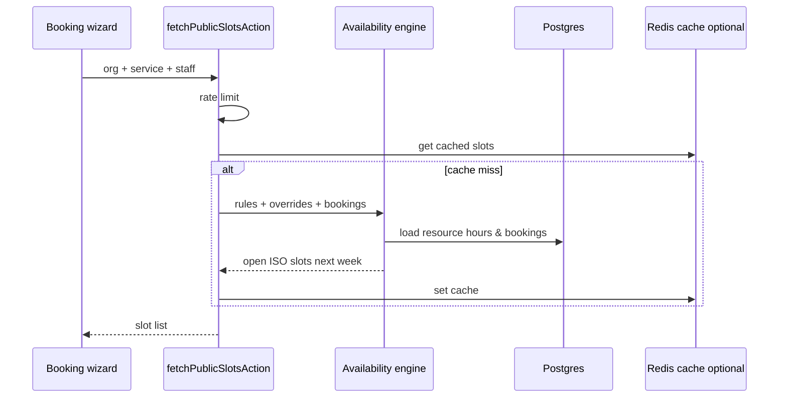

# BookFlow AI — system architecture

Multi-tenant booking SaaS for service businesses. Clients book publicly; owners run ops from a dashboard; AI and automation sit on top of the same org-scoped data.

## High-level

## Request paths

| Surface                | Who            | What happens                                    |
| ---------------------- | -------------- | ----------------------------------------------- |
| `/`                    | Prospects      | Marketing landing → Clerk sign-up               |
| `/book/[slug]`         | End customers  | 4-step wizard: service → staff → time → details |
| Custom domain          | End customers  | Middleware rewrites host → `/book/by-host`      |
| `/dashboard/*`         | Owners / staff | Calendar, CRM, AI, analytics, settings, billing |
| `/api/webhooks/clerk`  | Clerk          | Sync users into `User` + memberships            |
| `/api/webhooks/stripe` | Stripe         | Plan + subscription state                       |
| `/api/cron/reminders`  | Vercel cron    | Flush notification outbox                       |

## Tenancy & security

- Every business row hangs off `Organization`.
- Memberships map Clerk users → org roles (`OWNER` / `ADMIN` / `STAFF` / `VIEWER`).
- Postgres RLS + `withOrgRls` / tenant DB helpers enforce org isolation at query time.
- Public booking never sees other tenants; rate limits protect slot fetch and create booking.
- Security headers + CSP on responses (see Sprint 8 / `GO_LIVE.md`).

## Availability

## Automation (outbox)

Kinds: confirmation, cancellation, reminder, follow-up, review request, rebooking nudge.  
Channels: email (Resend), SMS (Twilio, plan-gated).  
Cron drains `NotificationOutbox` with retries and dedupe keys.

## AI

Dashboard AI workbench: client summaries, message drafts, insight digests, booking assistant with tools. Runs metered in `AiRun` against plan token budgets.

## Deploy topology

- **App:** Vercel (Hobby cron = daily; use external cron for tighter reminder windows).
- **DB:** Neon / Supabase Postgres (pooled URL in production).
- **Auth:** Clerk.
- **Optional:** Upstash Redis for shared rate limits + slot cache across instances.
