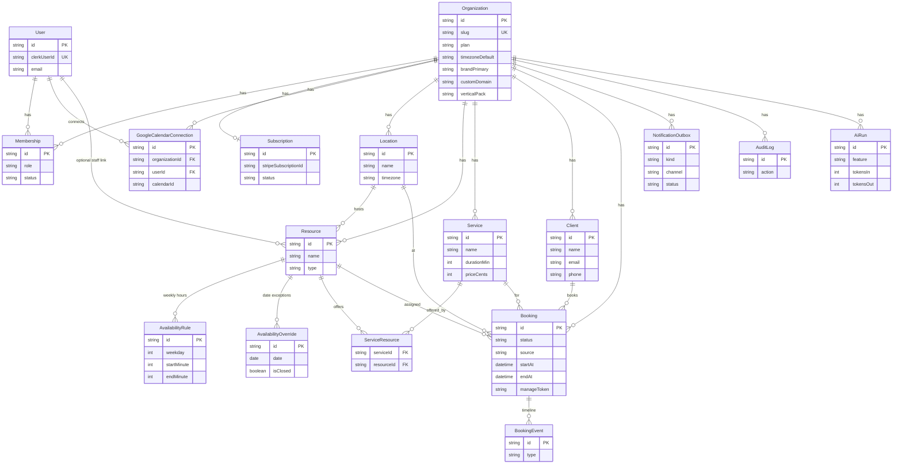

# BookFlow AI — database ERD

Source of truth: [`prisma/schema.prisma`](../../prisma/schema.prisma).  
17 models, org-centric multi-tenant design.

## Entity relationship diagram

## Design notes

- **Organization** is the tenancy root — branding, vertical pack, automation toggles, plan.
- **Resource** = staff / room / equipment; linked to users when the resource is a person.
- **ServiceResource** is the many-to-many that controls who can deliver which service.
- **Booking** is protected by Postgres exclusion constraints (no overlapping confirmed slots per resource).
- **NotificationOutbox** decouples “something happened” from “message sent” for reliable email/SMS.
- **AiRun** meters AI usage for plan entitlements.
